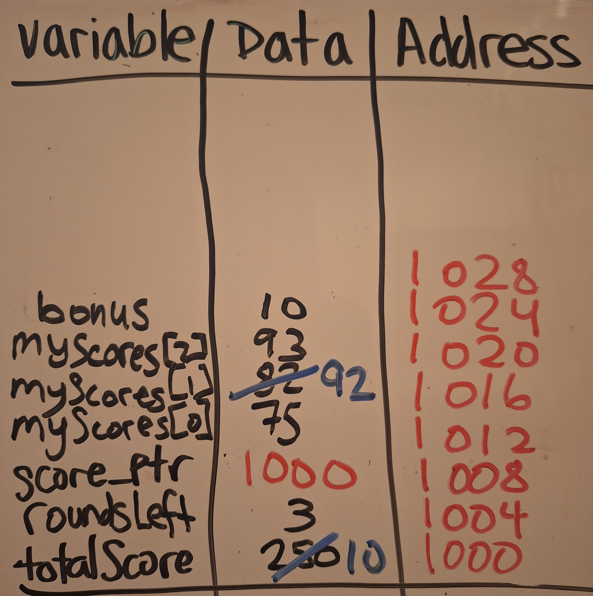

# Week 1 Lab

CSSSKL 133 - 1/10/25

    1. Running on your IDE - using the terminal
    2. Pointers - memory mapping
    3. Dynamic Memory - resizing arrays
    4. Making deep copies of objects

## 🚀 Running on your IDE - using the Terminal

* Ensure that your IDE of choice is set up and working.

* Print out a "Hello world" to make sure it works!

>🤔❓ What issues are you running into with your IDE?

✨If you run into an error and you're on Windows, you might need to download MinGW toolkit https://code.visualstudio.com/docs/cpp/config-mingw . Also verify that your environment variables (Path) are correct.

### Some common Bash commands I'll be using in the terminal

* Note: Use PowerShell or Bash, not cmd! Command Prompt (cmd) is set as the default. Use the + to choose a different terminal!

> * **g++ myfile.cpp -o main** - compile myfile, and save it to the executable called main
> * **./main** - run main
> * **ls** - lists all the files in the current directory
> * **cd ~** - return to the home directory (C:\Users\YourUsername)
> * **cd \path\to\destination** - go to that destination

✨ Use Tab to complete the path, or cycle through options.

✨ Use the up and down arrows to scroll through recent commands in the terminal.

## 👉 Pointers and Memory Management

* Recall that a pointer is an address in memory

```cpp
int size = 10;
int* size_ptr = &size;
cout << size_ptr; // prints out an address like 0x7fffac546ecc
```

📝 Practice: Memory mapping exercise

* Map ints and pointers to 4 bytes and use the next available space in the stack in order, from lowest to highest

```cpp
#include <iostream>

using namespace std;

int main() {
	int totalScore = 250;
	int roundsLeft = 3;
	int* score_ptr = &totalScore;
	
	int myScores[3] = {75, 82, 93};
	
	int bonus = 10;
	
	*score_ptr = bonus;
	
	myScores[1] += *score_ptr;
	

	return 0;
}
```


## 📏 Dynamic Memory - Resizing Arrays

>🤔❓ Why do we need to be careful when resizing dynamically allocated arrays? 

* We need to prevent memory leaks when we transfer data from one array to another. If its not properly deleted, the memory will have nothing pointing to it.

1. Create the new larger array
2. Copy over the elements from the original array
3. Delete the original array to free the memory
4. Assign the original array to point to the new array, and assign the new array to point `nullptr`
5. Now you can keep using the original array!

```cpp
int originalSize = 5;
int* original = new int[originalSize];

for (int i = 0; i < originalSize; i++) {
  original[i] = i+1;
}
// dynamically allocated new array
int doubledSize = originalSize * 2;
int* doubled = new int[doubledSize];

// copy existing elements to new array

for (int i = 0; i < originalSize; i++) {
  doubled[i] = original[i];
}

// delete the original array to free the memory
delete[] original;

// assign the original array to point to the new array
original = doubled;
doubled = nullptr;

// now we can just use original
for (int i = originalSize; i < doubledSize; i++) {
  original[i] = i+1;
}

delete[] original;
```


## 🖨️ Your turn: Deep Copy of an Object

* Turn to problem 1 of the lab, which explores creating a deep copy of an object, and how it differs from a shallow copy.

* Try it first with your group and then we will go through it together.

```cpp
// Problem 1 - Shallow vs Deep copy of an object
// Make two Books
Book book1("Effective Modern C++", 2015);
Book book2("Data Structures and Algorithm Analysis in C++", 2006);
cout << "Original books" << endl;
book1.printInfo();
book2.printInfo();

// Make a deep copy of one book
Book copyBook = book1;
cout << "Copied book" << endl;
copyBook.printInfo();
```

```cpp
class Book {
  private:
    string title;
    int* year;

  public:
    Book() {
      title = "Untitled Book";
      year = new int(2025);
    }
    Book(const string bookTitle, const int bookYear) {
      title = bookTitle;
      year = new int(bookYear);
    }  

    // Add your copy constructor here
    Book(const Book& other) {
      title = other.title;
      year = new int(*(other.year));
    }

    // Add your destructor here
    ~Book() {
      delete year;
    }

    void printInfo() const {
      cout << "Title: " << title << ", Year: " << *year << endl;
    }
};
```
